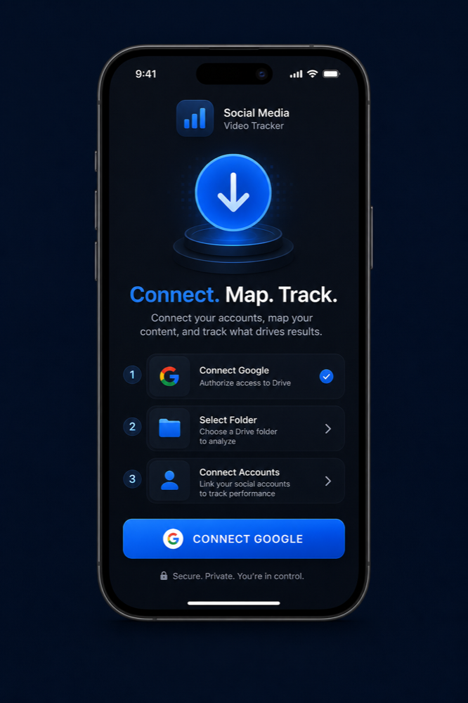
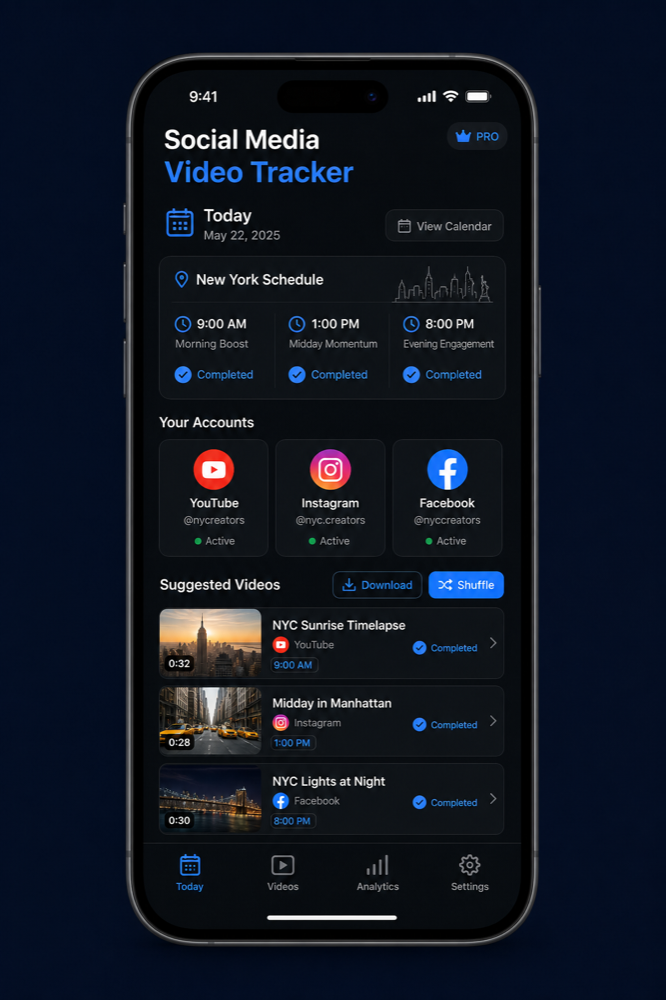
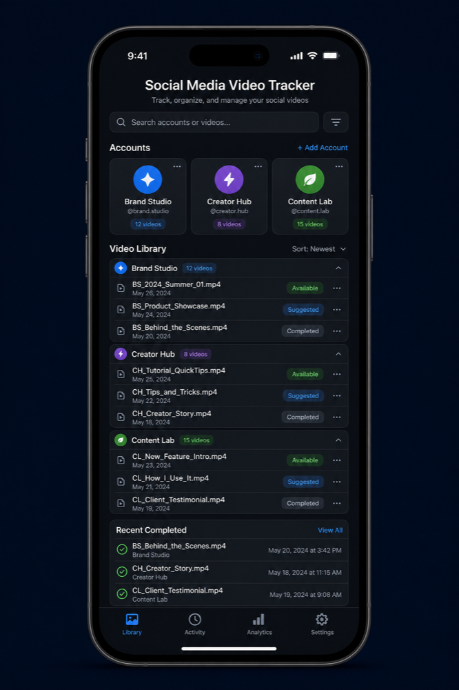

# Social Media Video Tracker

A local-first iPhone app for planning, downloading, and tracking social-media videos stored in Google Drive.

The app connects only to the Drive folders you select. Each folder can be associated with a different content account, given its own daily quota, and tracked independently. It does not automate publishing or require a backend server.

## App preview

<p align="center">
  
  
  
</p>

<p align="center"><sub>Connect selected folders · Plan daily downloads · Keep a permanent history</sub></p>

## Core workflow

1. Sign in with the Google account that can access the required Drive folder.
2. Paste a Drive folder link and associate it with a content account.
3. Choose the account name and daily video quota.
4. Let the app create a daily set of unused suggestions, or choose a different unused video manually.
5. Tap a video to stream a preview directly from Drive.
6. Download the original file to Photos. The tracker marks it completed only after the save succeeds.
7. Review daily, per-account, and all-time activity in Analytics.

Suggestions that are not completed can carry forward. Completed videos remain in history and are excluded from future suggestions, even when a Drive filename changes.

## Features

### Google Drive connections

- Uses the real Google Sign-In flow.
- Supports more than one Google account.
- Connects only folders explicitly added by the user; it does not scan the entire Drive.
- Accepts standard shared-folder links, folder IDs, and resource keys.
- Tracks nested folders and displays each video's folder path.
- Supports folders shared with the signed-in Google account.
- Identifies videos using the stable Drive file ID rather than the filename.
- Refreshes metadata quietly and detects newly added, renamed, moved, or removed videos.
- Keeps missing Drive files in historical records while excluding them from new suggestions.

### Daily planning

- Configurable daily quota for every account.
- Account-first Today screen for fast navigation when many accounts are connected.
- Random daily suggestions drawn only from unused videos.
- Shuffle action that never returns completed content.
- Manual picker for previewing and immediately downloading any unused video.
- Exact shortage reporting when an account does not have enough unused videos.
- Carry-over support for unfinished daily items.
- Automatic, deterministic account icons based on the account name and content category.

### Downloads and previews

- High-resolution Drive thumbnails throughout Today and Library.
- Tap-to-play streaming previews without downloading a temporary lower-quality copy.
- Authenticated Drive streaming for private and shared files.
- Downloads the original Drive file without video transcoding or quality reduction.
- Saves to an account-specific Photos album.
- Marks a video completed only after PhotoKit confirms the save.
- Supports cancellation, retry, re-download, and manual **Already Downloaded** completion.
- Records immutable history events for downloads, replacements, corrections, and resets.

### Analytics

Analytics are calculated entirely on the iPhone from local tracker data:

- Videos completed today
- Downloads during the last 7 days
- Downloads during the current month
- All-time unique completed videos
- 14-day activity chart
- 30-day per-account activity chart
- Daily average and best day
- Today, 7-day, and all-time totals for every account
- Total download actions and re-download attempts
- In-app downloads versus manually marked completions
- Completion count and completion rate
- Downloaded storage size
- Videos that are no longer present in Photos
- Recent download history

No analytics data is sent to an external analytics provider.

### Reminders

Optional local notifications use recognizable United States city labels:

| City | Time zone |
| --- | --- |
| New York | Eastern |
| Chicago | Central |
| Denver | Mountain |
| Los Angeles | Pacific |
| Anchorage | Alaska |
| Honolulu | Hawaii |

Changing the city in Settings immediately reschedules pending reminders. Reminder windows occur at 3:00 AM, 9:00 AM, 3:00 PM, and 9:00 PM in the selected zone. Accounts are staggered at five-minute intervals so several accounts do not receive the same reminder simultaneously.

iOS limits the number of pending local notifications, so the app schedules the nearest useful reminder set first. Nothing is downloaded automatically.

### Reliability and recovery

- SwiftData is the authoritative on-device database.
- Routine synchronization and backup run without success alerts.
- Important errors appear as a temporary bottom banner rather than a blocking dialog.
- A metadata-only JSON backup can be stored in Google Drive's hidden `appDataFolder`.
- Reauthentication does not erase local tracking history.
- A corrupt or unavailable backup never overwrites valid local data.
- Google tokens are handled by Google Sign-In and stored securely in the iOS Keychain.

## Technology

| Area | Implementation |
| --- | --- |
| Language and UI | Swift 6 and SwiftUI |
| Local persistence | SwiftData |
| Drive integration | Google Sign-In for iOS, Drive REST API, and `URLSession` |
| Video preview | AVFoundation |
| Photo saving | PhotoKit |
| Reminders | UserNotifications |
| Charts | Swift Charts |
| Minimum deployment | iOS 17 |

The app has no backend, advertising SDK, tracking SDK, or automated social-media posting integration.

## Requirements

- A Mac with a current Xcode release capable of building for iOS 17
- An iPhone running iOS 17 or later, or an iOS Simulator
- A Google Cloud project with the Google Drive API enabled
- An iOS OAuth client
- An Apple Personal Team or paid Apple Developer team for installation on a physical iPhone

## Google Cloud configuration

### 1. Create the OAuth project

1. Open [Google Cloud Console](https://console.cloud.google.com/).
2. Create or select a project.
3. Enable **Google Drive API** under **APIs & Services → Library**.
4. Configure the OAuth consent screen.
5. For a personal installation, select **External** and keep the app in **Testing**.
6. Add every Gmail address that will sign in to the app as a test user.

### 2. Configure scopes

The app requests:

- `https://www.googleapis.com/auth/drive.readonly` to inspect and download user-selected folders.
- `https://www.googleapis.com/auth/drive.appdata` to store the optional hidden metadata backup.

The broader read-only scope is required because a pasted or shared Drive link is not automatically authorized by the narrower `drive.file` scope.

### 3. Create the iOS OAuth client

1. Open **Google Auth Platform → Clients**.
2. Create a client with application type **iOS**.
3. Use bundle identifier:

   ```text
   com.saangetamang.DriveTracker
   ```

4. Copy the client ID and its reversed URL scheme.
5. Replace the two placeholders in [`DriveTracker/Info.plist`](DriveTracker/Info.plist):

   ```xml
   <key>GIDClientID</key>
   <string>YOUR_IOS_CLIENT_ID.apps.googleusercontent.com</string>
   ```

   ```xml
   <key>CFBundleURLSchemes</key>
   <array>
       <string>com.googleusercontent.apps.YOUR_REVERSED_CLIENT_ID</string>
   </array>
   ```

Do not commit a private OAuth client configuration to a public fork. The repository intentionally contains placeholders.

## Build and run

1. Clone the repository:

   ```sh
   git clone https://github.com/Sange-creator/social-media-video-tracker.git
   cd social-media-video-tracker
   ```

2. Add the Google OAuth values described above.
3. Open [`DriveTracker.xcodeproj`](DriveTracker.xcodeproj) in Xcode.
4. Select the **DriveTracker** target.
5. Open **Signing & Capabilities** and select your Apple team.
6. Choose a connected iPhone or iOS Simulator.
7. Press **Run**.

A free Apple Personal Team can install the app on a personal iPhone, but the provisioning profile normally requires periodic rebuilding. Reinstalling over the existing app preserves its local data; deleting the app also deletes the local SwiftData database.

## First-time app setup

1. Tap **Connect Google**.
2. Select the Gmail account that has access to the required Drive folder.
3. Allow the requested read-only Drive access.
4. Paste the specific folder link.
5. Enter the content-account name and daily quota.
6. Confirm the folder association.
7. Allow Photos access when downloading the first video.
8. Optionally enable reminders and choose a United States city in Settings.

Repeat the connection process when another folder belongs to a different Google account.

## Tests

Run the unit tests with an available simulator:

```sh
xcodebuild test \
  -project DriveTracker.xcodeproj \
  -scheme DriveTracker \
  -destination 'platform=iOS Simulator,name=iPhone 17 Pro' \
  -derivedDataPath /tmp/DriveTrackerDerivedData \
  CODE_SIGNING_ALLOWED=NO
```

The test suite covers Drive-link parsing, stable file identity, quota allocation, carry-over, shortages, manual selection, download deduplication, state transitions, and backup restoration.

## Project structure

```text
DriveTracker/
├── App/          App lifecycle and shared state
├── Models/       SwiftData entities and tracker status types
├── Services/     Drive, authentication, downloads, Photos, reminders, and backup
├── Views/        Onboarding, Today, Analytics, Library, Accounts, and Settings
├── Assets.xcassets/
├── Info.plist
└── PrivacyInfo.xcprivacy
```

## Troubleshooting

### Google login does not open

- Confirm that `GIDClientID` is an iOS OAuth client ID, not a web client ID.
- Confirm the reversed client ID is present under `CFBundleURLSchemes`.
- Confirm the OAuth client's bundle identifier exactly matches `com.saangetamang.DriveTracker`.

### A shared folder cannot be opened

- Make sure the selected Gmail account has permission to view the folder.
- Add that Gmail address as an OAuth test user while the project is in Testing.
- If Google shows more than one account, choose the account to which the folder was shared.

### Videos do not appear

- Pull to refresh or use the refresh button.
- Confirm the selected folder contains supported `video/*` Drive files.
- Check that the account is active and the folder association is correct.

### Preview or download fails

- Confirm the iPhone has an internet connection.
- Confirm the currently connected Google account matches the video's source.
- Check that the Drive owner permits downloading.
- Allow Photos access in **iPhone Settings → Privacy & Security → Photos**.

### Reminders do not arrive

- Enable reminders inside the app.
- Allow notifications in **iPhone Settings → Notifications**.
- Confirm the selected city and check that the account still has pending videos.

## Privacy

- Tracker data and analytics remain on the device.
- The optional Drive backup contains metadata only—never video files, Google tokens, or social-media credentials.
- Videos are transferred directly between Google Drive, the app, and Photos.
- The app does not request App Tracking Transparency permission.
- The app includes [`PrivacyInfo.xcprivacy`](DriveTracker/PrivacyInfo.xcprivacy).
- Settings provides separate controls for disconnecting Google, deleting local tracker data, and deleting the hidden Drive backup.

## Limitations

- Designed for one primary iPhone user.
- Publishing remains manual.
- The app cannot verify that a video was successfully published to an external social platform.
- Multi-device live synchronization is not included.
- Background Drive scanning is subject to normal iOS execution limits.
- App Store, TestFlight, and hosted backend deployment are outside this repository.

## License

Copyright © 2026 Saange Tamang.

Released under the [MIT License](LICENSE).
