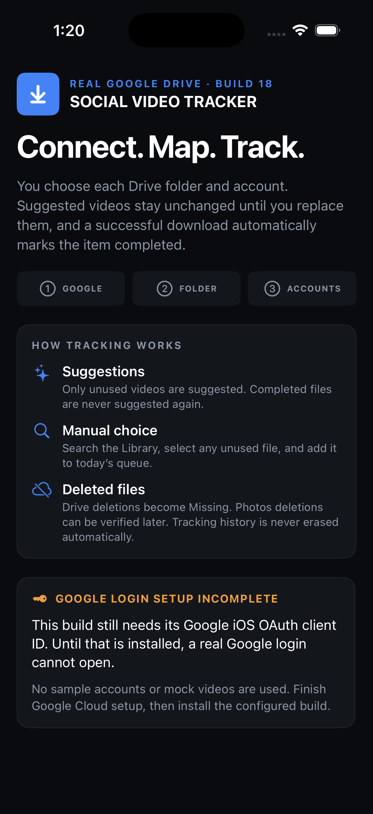

# Social Media Video Tracker

Local-first iPhone tracker for organizing videos in Google Drive before publishing them to social media.

It connects only to the Google Drive folders you choose, keeps every video’s history on-device, and helps each account maintain a consistent daily video queue—without automated posting or a backend server.

## Screenshot



## What it does

- Connects one or more Google accounts and explicitly selected Drive folders.
- Organizes each connected folder as a separate social-media account.
- Scans nested folders and tracks videos by stable Google Drive file ID—not filename.
- Suggests a configurable number of unused videos for each account every day.
- Lets you choose any unused video yourself and download it immediately.
- Shuffles only genuinely unseen videos into suggestions.
- Tracks `Available → Suggested → Downloaded → Completed`, with timestamped history.
- Allows a manual **Already Downloaded — Mark Completed** action for videos downloaded outside the app.
- Downloads the original Drive file and verifies its size/checksum before saving to Photos.
- Sends optional, account-specific local reminders at New York schedule windows, staggered by 10–30 minutes.
- Creates a small metadata-only recovery backup in Google Drive’s hidden `appDataFolder`.

## Privacy

- No advertising, analytics, tracking SDKs, server, or social-media login.
- Google access is limited to Drive read-only access and the app’s hidden metadata backup folder.
- Videos stay in Google Drive and/or your Photos library; the backup contains tracker metadata only.

## Requirements

- Xcode 26.5 or later
- iOS 17 or later
- A Google Cloud OAuth client for iOS
- A free Apple Personal Team or paid Apple Developer account for device installation

## Google Cloud configuration

1. Create/select a Google Cloud project and enable the **Google Drive API**.
2. Configure the OAuth consent screen as **External / Testing** and add yourself as a test user.
3. Add these scopes:
   - `https://www.googleapis.com/auth/drive.readonly`
   - `https://www.googleapis.com/auth/drive.appdata`
4. Create an **iOS** OAuth client using bundle ID `com.saangetamang.DriveTracker`.
5. In [`DriveTracker/Info.plist`](DriveTracker/Info.plist), replace the placeholder client ID and reversed client ID.

## Run locally

1. Open [`DriveTracker.xcodeproj`](DriveTracker.xcodeproj) in Xcode.
2. Select the `DriveTracker` target and choose your Personal Team under **Signing & Capabilities**.
3. Select an iPhone or Simulator and press Run.
4. In the app, connect Google, add the specific Drive folder for each account, and allow Photos/notifications when prompted.

## Test

```sh
xcodebuild \
  -project DriveTracker.xcodeproj \
  -scheme DriveTracker \
  -destination 'platform=iOS Simulator,name=iPhone 17 Pro' \
  CODE_SIGNING_ALLOWED=NO \
  test
```

## License

Released under the [MIT License](LICENSE).
